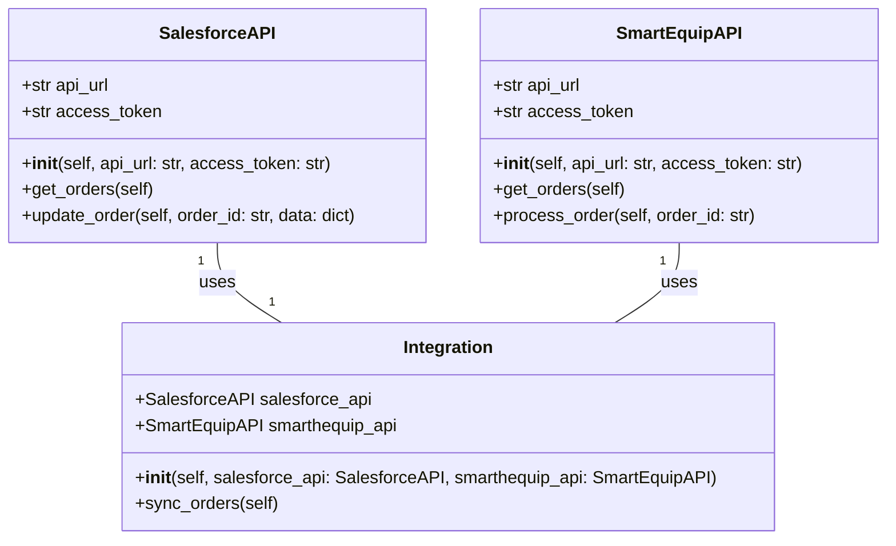
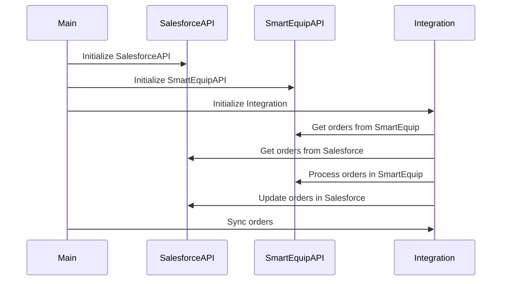

## Implementation approach
To implement the integration between Salesforce and SmartEquip, we will use the open-source Python library `simple_salesforce` for Salesforce API interactions and `requests` for SmartEquip API interactions. The main challenge is to ensure seamless data transfer between the two systems and handle any potential errors or inconsistencies in data. We will also use `Flask` to create a user-friendly web interface for the integration. The web interface will allow users to monitor the status of the integration and perform basic operations.

## Python package name
```python
"salesforce_smarthequip_integration"
```

## File list
```python
[
    "main.py",
    "salesforce_api.py",
    "smarthequip_api.py",
    "integration.py",
    "web_interface.py",
    "config.py"
]
```

## Data structures and interface definitions


## Program call flow


## Anything UNCLEAR
The requirement is clear to me. However, the specific API endpoints and data formats for Salesforce and SmartEquip are not provided in the requirement. We will need to consult the API documentation of both systems during the actual implementation.